# Software Architecture

A deep analysis of kel-circle's structure, data flow, and key design
patterns. Each section focuses on one architectural concern and includes
a diagram.

---

## Package layout

The project is a single Cabal package with two test suites and a
companion PureScript client library.

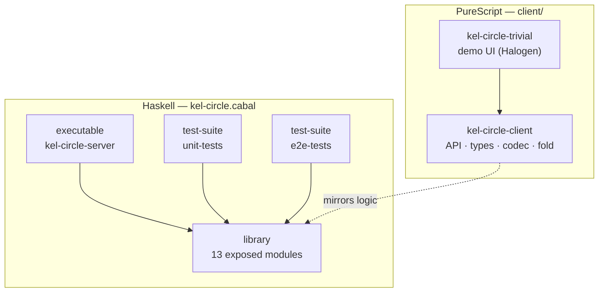

---

## Module dependency graph

Arrows point from importer to importee. Foundation modules have no
outgoing edges; the server sits at the top.

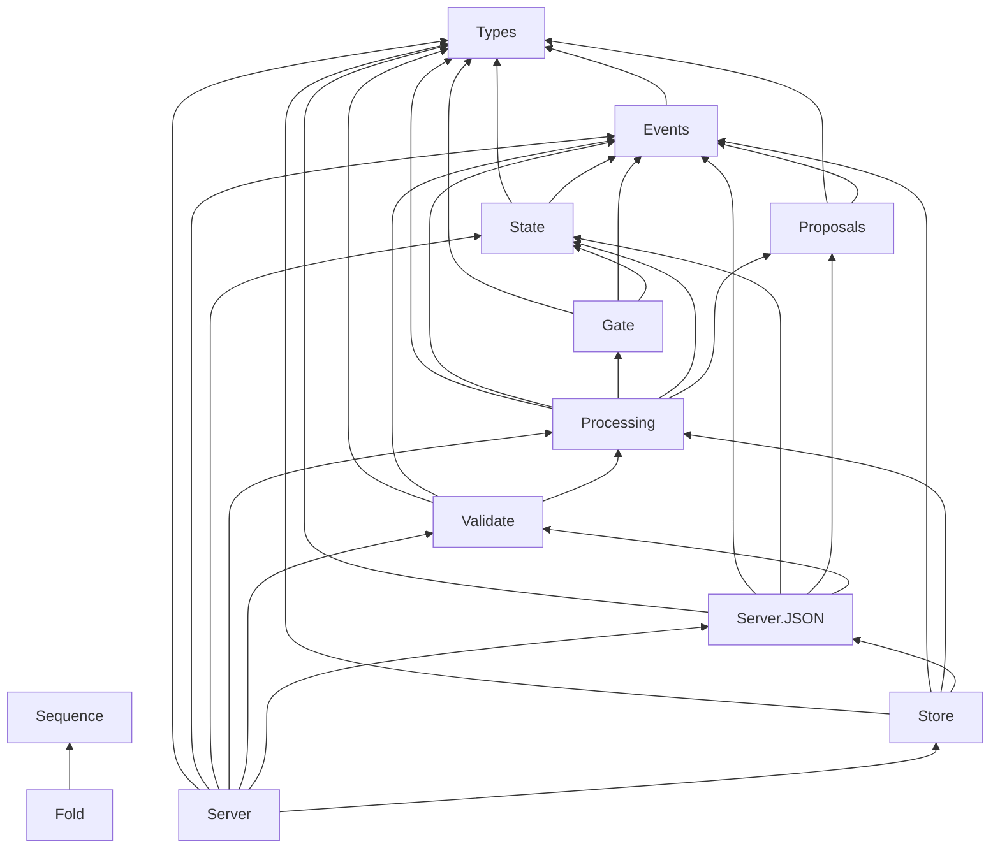

---

## Core type hierarchy

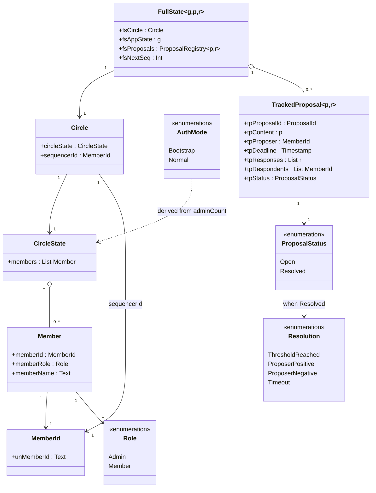

---

## Event type hierarchy

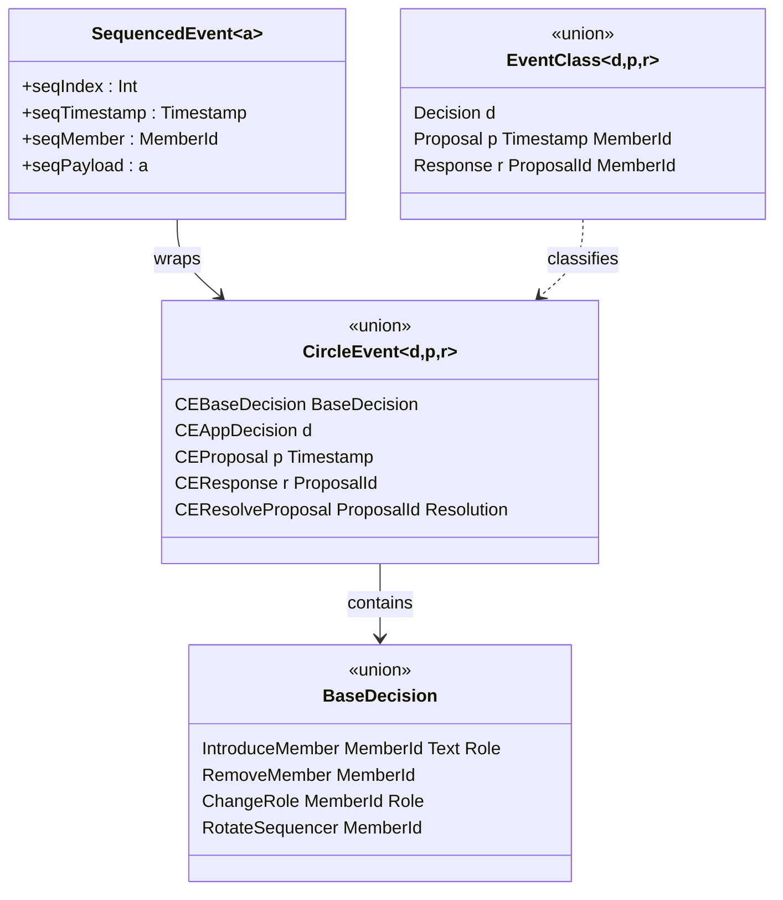

---

## Event flow: submission to state update

The path every event travels from the HTTP boundary to the updated
in-memory state.

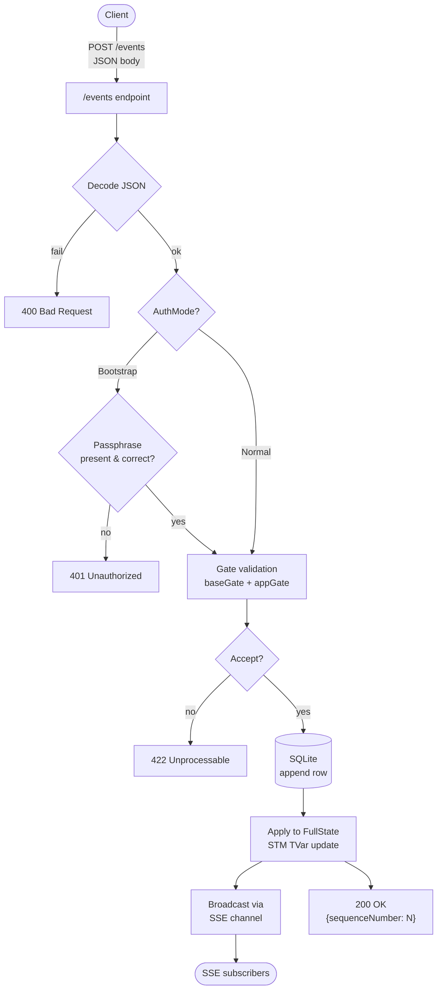

---

## Two-level gate validation pipeline

Every base-level decision passes through a chain of Boolean checks
before it is accepted.

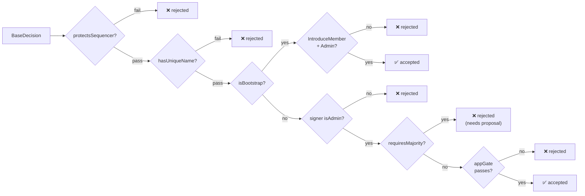

Gates for other event types:

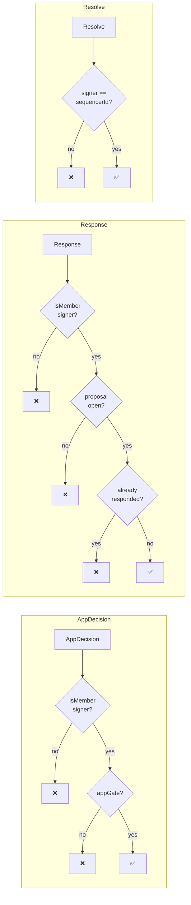

---

## Proposal lifecycle state machine

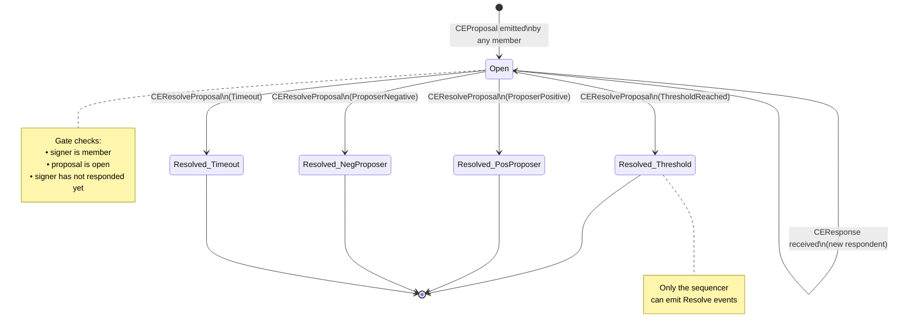

---

## Bootstrap mode lifecycle

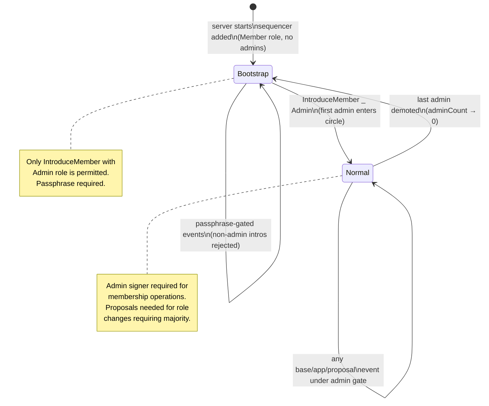

---

## Fold and replay mechanism

The same fold function is used both on startup (full replay from
SQLite) and on each new event (incremental update to the TVar).

```mermaid
flowchart TD
    subgraph Startup
        DB[(SQLite\nevents table)] -->|SELECT all rows| ROWS[Ordered rows\noldest → newest]
        ROWS --> FOLD[foldAll\napplyCircleEvent]
        FOLD --> FS0[Initial FullState]
        FS0 --> TV[(TVar FullState)]
    end

    subgraph OnNewEvent["On new event"]
        EV[New event] --> VAL[Gate validation]
        VAL --> INS[INSERT INTO events]
        INS --> READ[Read current TVar]
        READ --> APP[applyCircleEvent]
        APP --> WRITE["Write TVar\n(STM atomic)"]
    end

    subgraph Query
        TV2[(TVar FullState)] -->|readTVarIO| RESP[HTTP response\nor SSE]
    end
```

The fold is parameterized — the same infrastructure handles both the
fixed base fold and any pluggable application fold:

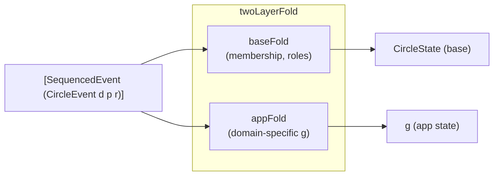

---

## Persistence layer

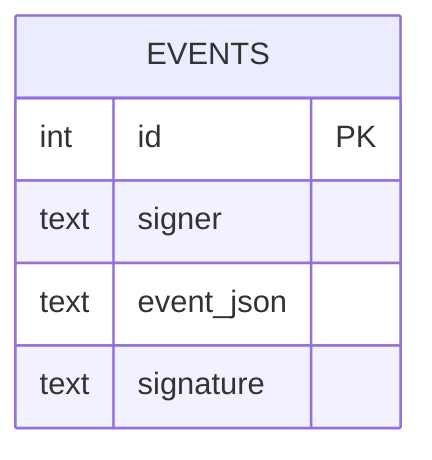

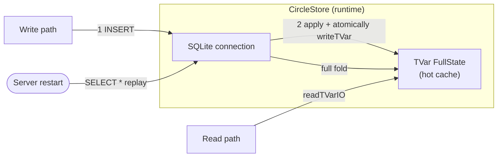

The hot TVar ensures O(1) reads; SQLite ensures durability across
restarts without requiring a separate replay on every query.

---

## Server HTTP interface

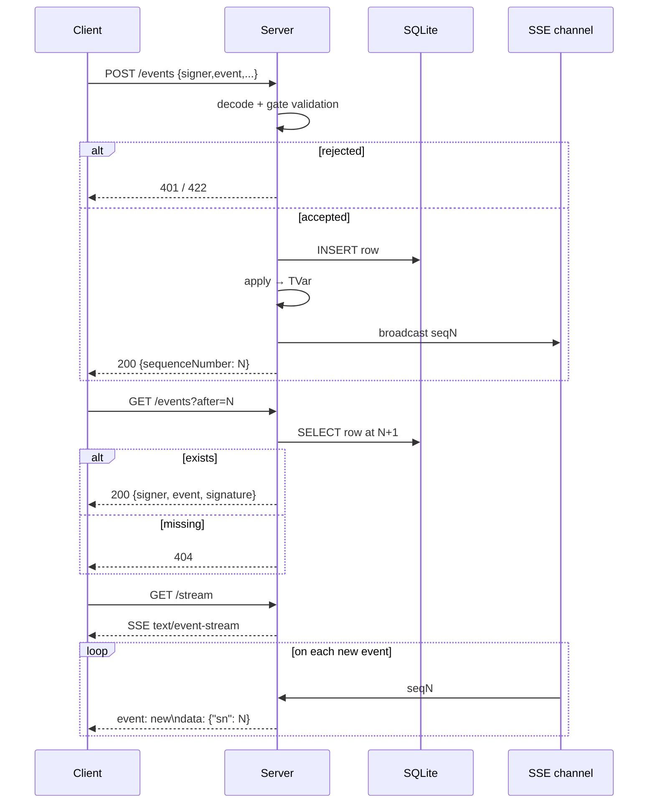

---

## Client sync loop

The PureScript client never trusts state from the server directly —
it re-derives state by replaying the event log from its last known
checkpoint.

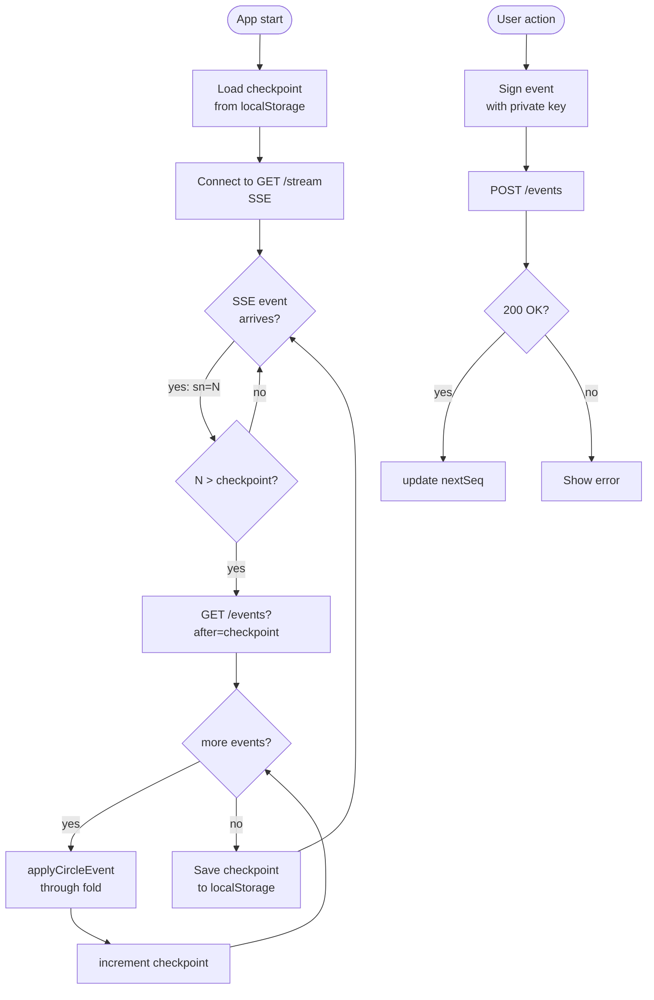

---

## Server/client trust boundary

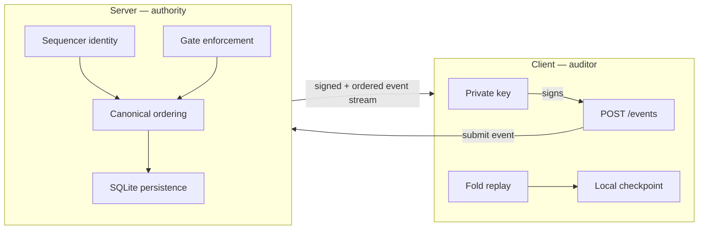

| Concern | Server | Client |
|---|---|---|
| Canonical ordering | ✓ | ✗ (audits) |
| Gate enforcement | ✓ (binding) | ✓ (UX hint) |
| Private key | ✗ | ✓ |
| State derivation | fold + TVar | fold + checkpoint |
| Signature creation | ✗ | ✓ |
| Signature verification | ✓ | ✓ |

---

## Apply functions: event → state transition

Each event type maps to exactly one apply function that touches a
specific subset of `FullState`.

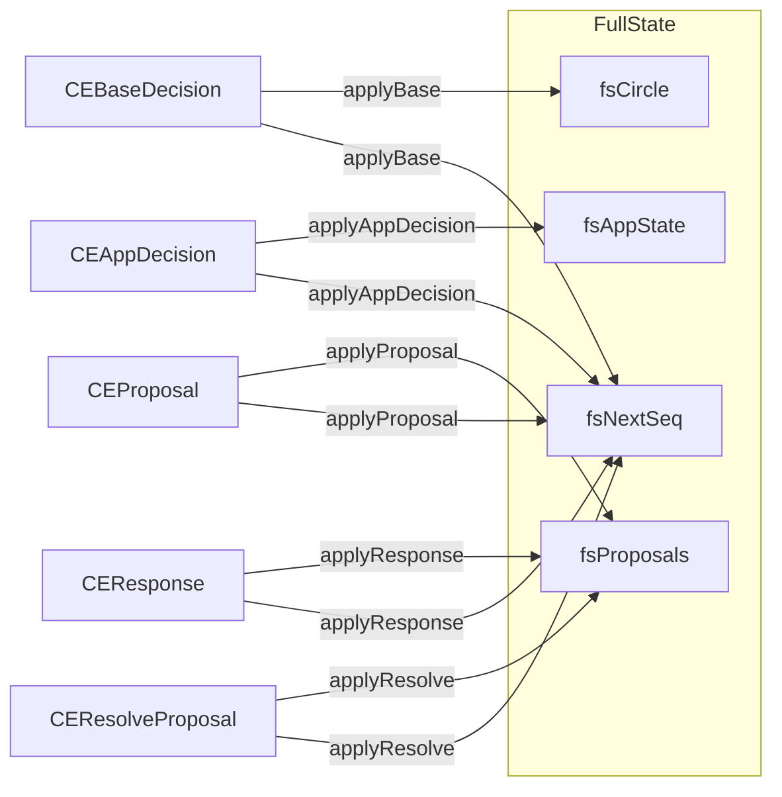

`fsNextSeq` is incremented by every apply function — it is the
monotonic sequence counter that clients use to detect new events.

---

## Admin majority voting

Role changes requiring admin consensus use the proposal machinery with
a `hasAdminMajority` threshold check.

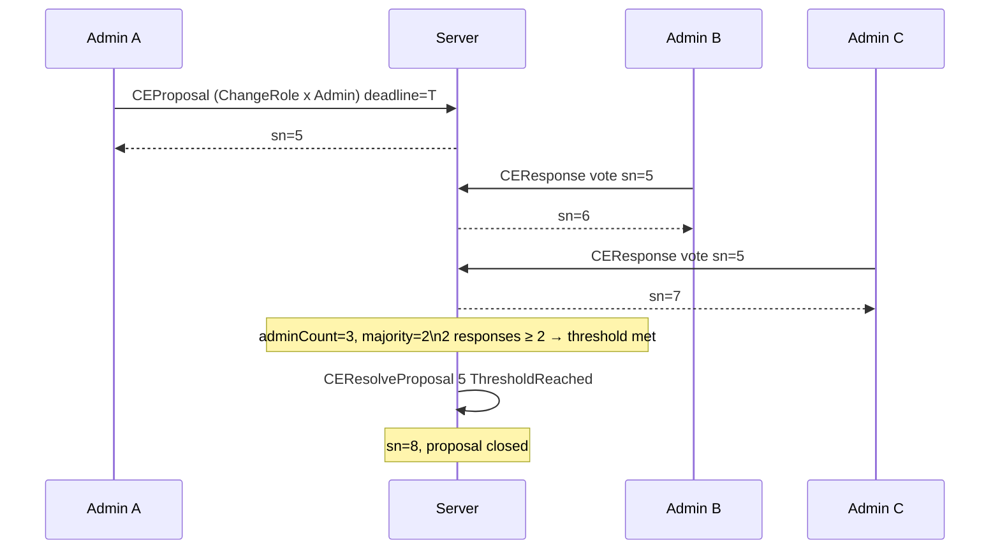

The majority threshold is `adminCount / 2 + 1` — with one admin,
that admin can act alone; with three admins, two are needed.

---

## Sequencer rotation

When the sequencer role moves to a new member, the old sequencer's
`memberName` is renamed to its `MemberId` string to preserve name
uniqueness.

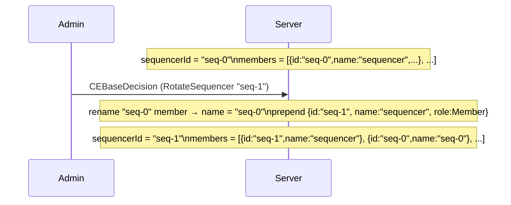

---

## Testing strategy

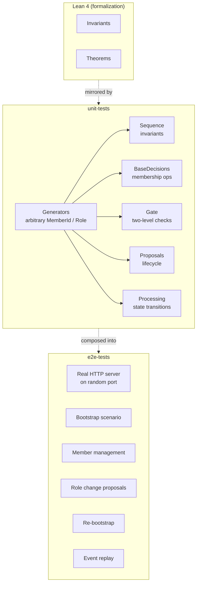

Properties are named to mirror Lean theorems:
`bootstrap_accepts_admin_intro`, `full_gate_base_rejects`,
`resolution_dichotomy`, etc., making the correspondence between the
formal proof and the executable tests explicit.
