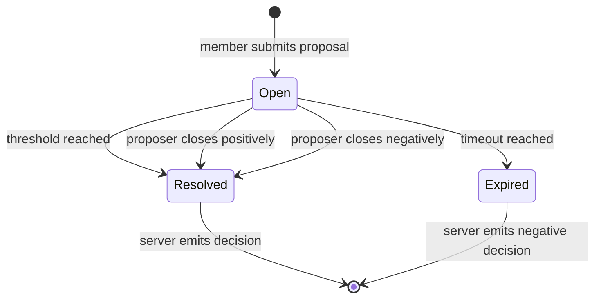

# Event Classification

The global sequence contains events of three classes. The classes
are fixed by the protocol; the **content** within each class is
parameterized by the application.

## The three event classes

### 1. Straight decision

A straight decision is an event that, as long as it passes both
the base gate and the application gate, is accepted and immediately
changes the fold state. No coordination machinery is involved — no
proposal, no voting, no timeout.

The two-level gate for straight decisions:

```
baseGate        :: CircleState -> MemberId -> MemberId -> BaseDecision -> Bool
applicationGate :: AppFoldState -> BaseDecision -> Bool
```

If both gates return true, the decision is sequenced and the fold
advances. If either returns false, the event is rejected.

Straight decisions are the simplest path: a member submits, the
server validates through the two-level gate, the fold updates.

### 2. Proposal

A proposal is an event that initiates a coordination round. It
contributes to the fold like any other sequenced event, and also
opens a window for responses that eventually resolves into a
decision (positive or negative).

A proposal carries:

- **Mandatory timeout** — bounded by the server's configured
  maximum. If no positive resolution occurs before the timeout,
  the sequencer emits a **negative decision** automatically.

- **Optional threshold gate** — a function over collected
  responses:

    ```
    thresholdGate :: [ResponseContent] -> Bool
    ```

    When the threshold is met, the sequencer emits a **positive
    decision** automatically.

### 3. Response

A response is an event submitted by a member in reaction to an
open proposal. Its content is application-defined — the protocol
does not prescribe what a response looks like, only that it
references a specific proposal.

Responses contribute to the fold like any other sequenced
event. They also accumulate for lifecycle tracking until:

- The threshold gate fires (if present), or
- The proposer closes the proposal, or
- The timeout expires

**Lean predicates:** `EventClass`, `event_trichotomy`,
`decision_not_proposal`, `decision_not_response`,
`proposal_not_response`,
`Resolution`, `ProposalStatus`, `TrackedProposal`,
`ProposalRegistry`

## Proposal lifecycle



### Opening

A member submits a proposal event. The sequencer validates it
(base gate + application gate), assigns a sequence number, and
records it as open with its timeout deadline.

### Collecting responses

Members submit response events referencing the proposal. Each
response is sequenced and associated with the open proposal.

### Resolution

A proposal resolves in one of four ways:

1. **Threshold reached** — if the proposal has a threshold gate and
   enough valid responses accumulate to satisfy it, the sequencer
   emits a positive decision. The decision carries the responses
   that satisfied the threshold.

2. **Proposer closes positively** — the original proposer can close
   their proposal at any time with a positive outcome. They must
   include a subset of the collected responses. The sequencer emits
   a decision carrying those responses.

3. **Proposer closes negatively** — the proposer cancels the
   proposal. The sequencer emits a negative decision.

4. **Timeout** — the deadline passes without resolution. The
   sequencer emits a negative decision automatically. This is
   guaranteed because the timeout is mandatory.

### Server-emitted decisions

In cases 1, 3, and 4, the **sequencer itself** emits the decision
event. This is why the server is a circle member with its own KEL
— it signs these decision events with its own key.

The server-emitted decision is a regular event in the global
sequence. Clients can verify its signature against the server's
KEL just like any other event.

### Response validation

A member can respond to an open proposal at most once. The
protocol tracks respondents per proposal and rejects duplicate
responses. Only open proposals accept responses — once resolved,
no further responses are accepted.

### Timeout obligation

Every proposal has a mandatory deadline. The sequencer must
resolve any open proposal whose deadline has passed. This is a
**liveness obligation** on the sequencer: as long as the sequencer
is running, no proposal remains open past its deadline. Resolved
proposals trivially satisfy this obligation.

### Admin majority as a threshold gate

Admin role changes (promote/demote) use the proposal mechanism
with **admin majority** as the threshold gate. The threshold
checks whether the number of admin respondents meets the majority
threshold for the current circle. A single admin trivially meets
majority with their own response, which is why a lone admin can
demote themselves.

**Lean predicates:** `openProposal`, `addResponse`,
`resolveProposal`, `findProposal`,
`open_proposal_is_open`, `open_proposal_no_responses`,
`resolve_resolved_noop`, `resolution_dichotomy`,
`threshold_is_positive`, `proposer_positive_is_positive`,
`proposer_negative_is_negative`, `timeout_is_negative`,
`timeoutObligation`, `resolved_satisfies_obligation`,
`adminMajorityMet`, `single_admin_majority_self`,
`hasNotResponded`, `canRespond`,
`fresh_proposal_accepts_response`

## All event classes contribute to the fold

All three event classes — decisions, proposals, and responses —
advance the fold state when sequenced. The fold has two layers:

- **Base fold** — extracts membership and role information from all
  event types. This layer is fixed by the protocol. The base gate
  uses only the base fold to check membership, roles, and freshness.

- **Application fold** — accumulates domain-specific state from all
  event types. This layer is pluggable. The application gate uses
  the full fold (base + application) to validate domain rules.

The event classification still matters for the proposal lifecycle
(proposals open coordination rounds, responses accumulate within
them, decisions resolve them) but all three classes feed into the
fold. A future optimization may allow skipping fully resolved
proposals during fold replay, but the base model treats every
sequenced event as a fold input.

This means:

- No separate L1/L2 event logs
- One global sequence for everything
- Every sequenced event advances the fold
- Full audit trail preserved in the sequence

**Lean predicates:** `foldAll`, `fold_empty`, `fold_append`,
`TwoLayerState`, `twoLayerFold`, `two_layer_fold_empty`,
`two_layer_fold_append`

## Application parameterization

The protocol fixes the **event classes** (decision, proposal,
response) but leaves the **content** to the application:

| Aspect | Protocol (fixed) | Application (parameterized) |
|--------|------------------|-----------------------------|
| Event classes | decision, proposal, response | — |
| Membership | base-layer, extracted from fold | — |
| Admin roles | base-layer | — |
| Decision content | — | domain-specific payload |
| Proposal content | timeout, threshold gate shape | domain-specific payload |
| Response content | — | domain-specific payload |
| Base gate | membership, freshness, sequencer protection | — |
| Application gate | — | domain-specific validation |
| Threshold gate | — | application-defined function |

The application supplies:

- Types for decision, proposal, and response content
- An application gate function (for base decisions:
  `AppFoldState -> BaseDecision -> Bool`)
- An optional threshold gate function per proposal
  (`[ResponseContent] -> Bool`)
- A fold function that applies events to state
